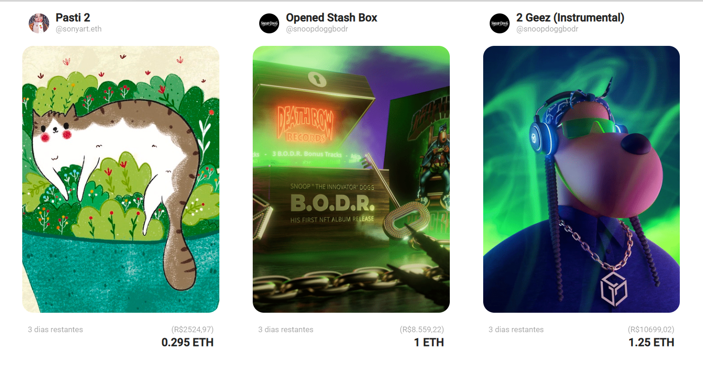
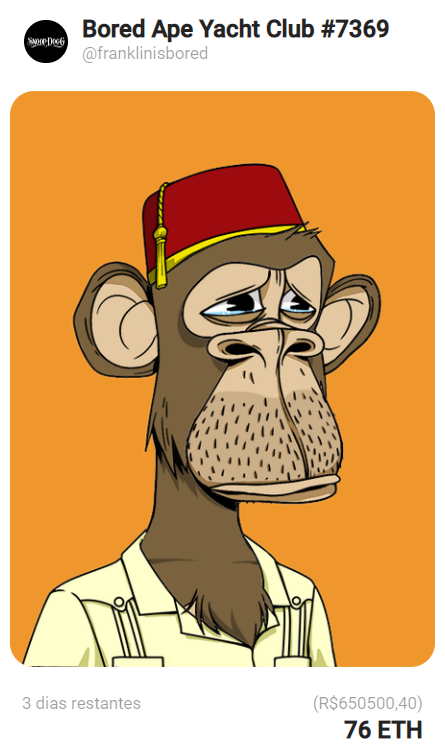

### <b>Exercício 1 - NFT Store</b>

#### <b>Objetivo</b>
Construir uma tela inicial para uma loja de NFT.

O painel inicial será populado com uma lista pré-definida, sem utilização de API, e irá renderizar um componente com o nome "CardNFT" para cada objeto presente na lista.

<b>Informações do objeto NFT:</b>

``` 
{
    "id": numero,
    "nome": string,
    "criador": string,
    "nickcriador": string,
    "foto_perfil": string,
    "imagem_nft": string,
    "categoria": string,
    "preco": float,
    "precoreal: string,
    "moeda": string
}
```

<b>Lista com NFTs:</b>
```
[
    {
      id: 0,
      nome: 'Pasti 2',
      criador: 'sonyart',
      nickcriador: '@sonyart.eth',
      foto_perfil: 'https://lh3.googleusercontent.com/EZMq0106S03X0DsKFdVO9TH2-kbE1zgwF_36i9k0vbqJmUZV_0p0iz1e1PX-nx19eULcbN0UB7NhcCnKyG1l_4FA1kJosLsWKb3S=s168',
      imagem_nft: 'https://img.seadn.io/files/8008d4e396a7f32bdf7a58025a19d75e.jpg?fit=max&w=600',
      categoria: 'ilustracao',
      preco: 0.295,
      precoreal: '2524,97',
      liked: false,      
      moeda: 'ETH'
    },
    {
      id: 1,
      nome: 'Opened Stash Box',
      criador: 'Snoop Dogg - B.O.D.R',
      foto_perfil: 'https://openseauserdata.com/files/3e7bcd3baad1c870e13fefae79633e13.png',
      nickcriador: '@snoopdoggbodr',
      imagem_nft: 'https://lh3.googleusercontent.com/OjKan_e5lUX4Dgaj61CUObNpS96ZWAT1eYCNh-5__L90_jyeLc8Iih1P_LY3-RJSl_kajSVeqO0BxHjdfk8CtgeRqBavzOBXYTO9KFM=w600',
      categoria: 'musica',
      preco: 1,
      precoreal: '8.559,22',
      liked: false,
      moeda: 'ETH'
    },
    {
      id: 2,
      nome: '2 Geez (Instrumental)',
      criador: 'Snoop Dogg - B.O.D.R',
      foto_perfil: 'https://openseauserdata.com/files/3e7bcd3baad1c870e13fefae79633e13.png',
      nickcriador: '@snoopdoggbodr',
      imagem_nft: 'https://lh3.googleusercontent.com/Q248R9pfAbkQlZKE8Xe1qXpj5MoX6W8e_0mljGdFaWpzajrG1xPkNWyCibkBCZKAVjSyE_ivw2vT0ItJPvKet57fy-hKBQ5AWkAI=w600',
      categoria: 'musica',
      preco: 1.25,
      precoreal: '10699,02',
      liked: false,
      moeda: 'ETH'
    },
    {
      id: 3,
      nome: 'Bored Ape Yacht Club #7369',
      criador: 'Bored Ape Yacht Club',
      foto_perfil: 'https://openseauserdata.com/files/3e7bcd3baad1c870e13fefae79633e13.png',
      nickcriador: '@franklinisbored',
      imagem_nft: 'https://img.seadn.io/files/ef6bcb8f383c1f74c5f7ccc92b9b46e8.png?fit=max&w=600',
      categoria: 'ilustracao',
      preco: 76,
      precoreal: '650500,40',
      liked: false,
      moeda: 'ETH'
    },    
  ]
```

#### <b>Informações de design (CardNFT):</b>

Largura total do componente: 374px;<br>
Margem: 20px;<br>
Cor dos textos: #232323;<br>
Dimensão da imagem NFT: 374px (w) x 500px (h);<br>
Tamanhos de fonte: 20px, 16px e 14px;<br>
border-radius nft: 30px;<br>
box-sizing: border-box;<br>
font-family: 'Roboto', sans-serif;<br>

#### <b>Imagens</b>

NFT Store


Card NFT