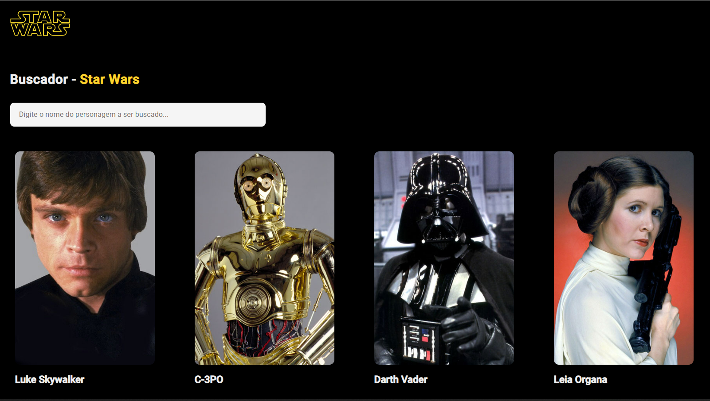

### <b>Exercício Star Wars</b>

#### <b>Objetivo</b>
Construir uma tela de busca de personagens do Star Wars.

A tela será populada com uma lista pré-definida, sem utilização de API, e irá renderizar um componente com o nome "CardSW" para cada objeto presente na lista.

<b>Informações do objeto personagem:</b>

``` 
{
    "id": numero,
    "nome": string,    
    "imagem": string
}
```

<b>Lista com os personagens:</b>
```
[
        {
            id: 1,
            nome: 'Luke Skywalker',
            imagem: 'https://starwars-visualguide.com/assets/img/characters/1.jpg'
        },
        {
            id: 2,
            nome: 'C-3PO',
            imagem: 'https://starwars-visualguide.com/assets/img/characters/2.jpg'
        },
        {
            id: 3,
            nome: 'Darth Vader',
            imagem: 'https://starwars-visualguide.com/assets/img/characters/4.jpg'
        },
        {
            id: 4,
            nome: 'Leia Organa',
            imagem: 'https://starwars-visualguide.com/assets/img/characters/5.jpg'
        },
        {
            id: 5,
            nome: 'R2-D2',
            imagem: 'https://starwars-visualguide.com/assets/img/characters/3.jpg'
        },
        {
            id: 6,
            nome: 'Obi-Wan Kenobi',
            imagem: 'https://starwars-visualguide.com/assets/img/characters/10.jpg'
        }
    ]
```

#### <b>Informações de design (CardNFT):</b>

Largura total do componente: 320px;<br>
Margem: 20px;<br>
Cor dos textos: #f0f0f0;<br>
Dimensão da imagem do personagem: 320px (w) x 429px (h);<br>
Tamanho da fonte: 16px;<br>
border-radius imagem: 10px;<br>
box-sizing: border-box;<br>
font-family: 'Roboto', sans-serif;<br>
Logo star wars: http://vignette1.wikia.nocookie.net/disney/images/8/8b/Starwars-logo.png/revision/latest?cb=20141129122237

#### <b>Imagens</b>

Home


Home com busca